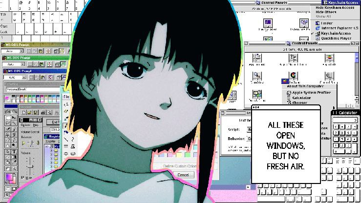

 
 
 
 
 

### 👋 Hey fellas!

I have no Mouth, and i must scream.

💡 Between logic and imagination, I seek the code of existence.

<!-- Your First Image -->

  

<!-- PLACEHOLDER: Your Second Image Goes Here -->
<!-- 

  

-->

 

---

#### 🛠️ My Toolkit

| Frontend & Mobile | Backend & Databases | Tools & Platforms |
| :--- | :--- | :--- |
|   |   |    |

---

~ [_nietz7che_](https://github.com/nietz7che-cloud)

